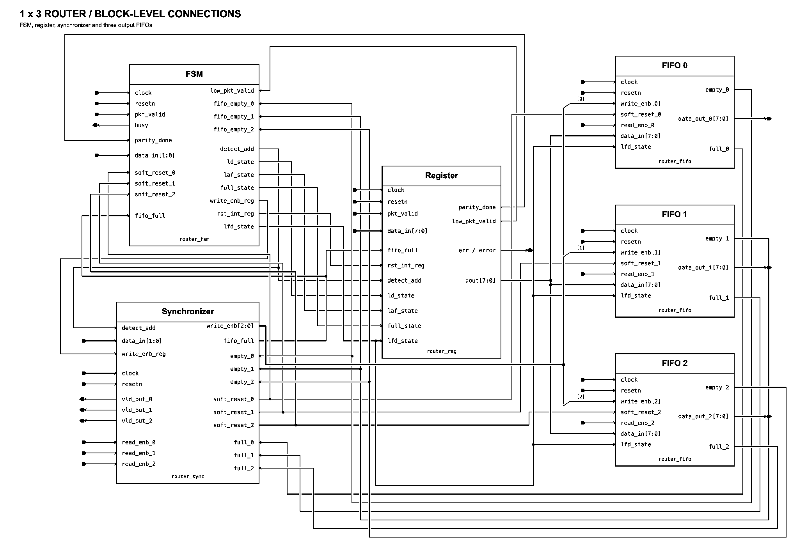

# 1×3 Packet Router: RTL Design and UVM Verification

A SystemVerilog/UVM verification project for an 8-bit packet router with one input and three output FIFOs. The testbench combines directed boundary cases, constrained-random packets, parity-error injection, independent monitors, a packet scoreboard, and functional coverage.

The supplied regression evidence records **5,024 matched packets, zero mismatches, and 100% of the defined functional coverage model**. A separate mutation-test result records 74 mismatched packets, demonstrating that the checker detected the corrupted output in that run.

## Project layout

```text
router-1x3-uvm/
├── rtl/                 Router top, FSM, register, synchronization and FIFO RTL
├── tb/                  UVM transactions, sequences, agents, scoreboard and coverage
├── sva/                 FIFO and FSM assertions with bind statements
├── synthesis/           Yosys scripts and preserved synthesis netlists
│   └── experimental/    Unverified timing setup and SDC constraints
├── scripts/             Lint and synthesis launchers
├── reports/             Results, provenance and supporting evidence
├── docs/                Testbench reading guide and figure placeholders
├── run.sh               VCS/UVM simulation launcher
└── .gitignore
```

## Packet format

| Field | Meaning |
|---|---|
| Header `[7:2]` | Payload length, 1–63 bytes in the current stimulus |
| Header `[1:0]` | Destination: `00`, `01`, or `10`; `11` is excluded |
| Payload | The number of 8-bit bytes encoded in the header |
| Parity | XOR of the header and payload bytes; selected tests flip one parity bit |

The write driver asserts `pkt_valid` for the header and payload and deasserts it for the parity byte. It waits while `busy` is asserted before driving the next byte. Each read driver delays by 1–5 cycles after output becomes valid, then enables reads until its FIFO empties.

## Router architecture

[`router_top.v`](rtl/router_top.v) connects:

- **`router_reg`** — captures the header, stages incoming data and maintains parity-related state.
- **`router_fsm`** — controls address decode, packet loading, FIFO-full handling and parity processing.
- **`router_sync`** — selects the destination FIFO, generates output-valid signals and triggers an output timeout reset after 30 unread valid cycles.
- **Three `router_fifo` instances** — each holds 16 entries of 8-bit data plus a header tag, with registered read data.

**Figure placeholder:** add `docs/router_architecture.png` after drawing the router block diagram. See [figure notes](docs/README.md).
<!-- Enable after the file is added:  -->

## UVM verification architecture

One write agent drives the input. Three read agents service outputs 0, 1 and 2. A virtual sequencer coordinates the four agent sequencers, while the virtual sequence starts each packet's writer and selected reader concurrently.

The write monitor reconstructs input packets and publishes them to both the scoreboard and coverage subscriber. Each read monitor reconstructs output packets and publishes them to its own scoreboard callback. The scoreboard compares header, payload length, every payload byte, and the transmitted parity byte.

Expected and actual queues are kept separately for each destination. Either monitor may finish first; the second arrival triggers comparison with the oldest queued packet for that port. End-of-test checks detect unmatched packets, unequal counts and mismatches.

**Figure placeholder:** add `docs/uvm_architecture.png` after drawing the testbench hierarchy.
<!-- Enable after the file is added:  -->

For a guided code review, start with the [testbench reading guide](docs/testbench_guide.md). Comments in the source explain the packet timing, queue matching, parity injection and sequence coordination in the project's existing short-comment style.

## Verified results

| Check | Recorded result | Evidence |
|---|---|---|
| UVM regression | 5,024 expected, 5,024 actual, 5,024 matched, 0 mismatched | [Regression summary](reports/regression_summary.txt) |
| End-of-test state | All six scoreboard queues empty | [Regression screenshot](reports/evidence/regression.png) |
| UVM severities | 0 warnings, 0 errors, 0 fatals | [Regression screenshot](reports/evidence/regression.png) |
| Defined functional coverage | 100%; 5,024 sampled input packets | [Coverage summary](reports/functional_coverage.txt) |
| Mutation test | 74 expected, 74 actual, 0 matched, 74 mismatched; 2,516 UVM errors | [Mutation summary](reports/mutation_test.txt) |
| RTL lint | 0 warnings, 0 errors | [Lint summary](reports/lint_summary.txt) |
| Generic synthesis | Yosys completed; 2,026 cells including submodules | [Synthesis summary](reports/synthesis_summary.txt) |
| SKY130 HD mapping | Reported cell area **23,804.08 µm²**, TT / 25°C / 1.8 V | [Synthesis summary](reports/synthesis_summary.txt) |

The UVM and mutation results come from the supplied screenshots; they were not rerun during repository cleanup because VCS is unavailable in the cleanup environment. Lint and both synthesis flows were rerun successfully after reorganizing the files. The regenerated netlists match the supplied netlists when comments and whitespace are ignored. See [cleanup validation](reports/cleanup_validation.txt) and the [evidence index](reports/README.md).

### Functional coverage

| Coverage item | Result |
|---|---:|
| Destination | 100% |
| Payload size group | 100% |
| Normal / bad-parity packet | 100% |
| Boundary lengths: 1, 13, 14, 30, 31, 63 | 100% |
| Destination × size | 100% |
| Destination × error type | 100% |
| Size × error type | 100% |
| Destination × size × error type | 100% |

The default sequence sends 18 packets spanning destination × size group × error type, six boundary packets, then 5,000 random packets. Size ranges are grouped as 1–13, 14–30 and 31–63 bytes. Full coverage refers to these defined input-packet bins; it does not establish exhaustive functional or code coverage.

## Run the project

Run the commands below from the repository root. Build outputs are written under the ignored `build/` directory, leaving the archived evidence and netlists intact.

### UVM simulation

Requires a licensed Synopsys VCS installation with UVM 1.2, configured in the shell. The archived simulation identifies VCS X-2025.06-SP1. No simulator or license configuration is bundled.

```bash
./run.sh +ntb_random_seed=1
```

Inspect `build/uvm/simulation.log` for the scoreboard totals, coverage and UVM severity counts. Waveforms are written to `build/uvm/dump.vcd`. Seed 1 is an example for a repeatable new run; the original screenshot does not record its seed.

The launcher compiles `rtl/router_top.v` and `tb/testbench.sv` with their include directories. These files already include their child files, so do not compile every `.v` or `.sv` file separately.

To include the existing bound assertions in a **new, unverified SVA run**:

```bash
./run.sh --sva +ntb_random_seed=1
```

Inspect both compile and simulation logs in `build/uvm-sva/`. SVA properties are included in the repository; no clean bound-assertion regression is claimed.

### RTL lint

```bash
./scripts/lint.sh
```

The cleanup check used Verilator 5.052 with warnings treated as failures. This checks RTL, not the UVM classes.

### Synthesis

```bash
./scripts/synth_generic.sh

export SKY130_LIB="/absolute/path/to/sky130_fd_sc_hd__tt_025C_1v80.lib"
./scripts/synth_sky130.sh
```

Requires Yosys and, for technology mapping, the SKY130 HD Liberty file. The archived and cleanup runs used Yosys 0.69+post. Results go to `build/generic/` and `build/sky130/`; the Liberty file is a local dependency and is not distributed here.

Yosys reports two limited-tristate-support warnings for the FIFO's high-impedance output assignments. The SKY130 flow also emits ABC messages about multi-output library cells and combinational mapping. These messages are retained in the evidence. The area is a synthesis cell-area result, not a placed-and-routed area or a timing signoff result.

## Verification scope and remaining work

- **SVA:** five FIFO properties and three FSM properties are included and bound in `sva/router_assertions.sv`. Successful execution has not been established.
- **Timing:** the archived OpenROAD attempt failed with `ORD-2010: no technology has been read`. Experimental timing files are retained separately; the 10 ns SDC constraint is a target, not evidence of 100 MHz operation.
- **Error checking:** bad parity is injected and forwarded bytes are compared. The scoreboard does not check the timing or value of the DUT `error` output.
- **Traffic scope:** the default sequence completes one packet's writer/reader pair before starting the next. Read monitors assume continuous output bytes after the header. The timeout read sequence exists but is not started by the default test; timeout recovery, mid-packet reset and overlapping packets need dedicated verification.
- **Checker scope:** transaction data fields use two-state `bit` types, so the current comparison does not provide dedicated X/Z detection. No gate-level simulation or formal equivalence result is claimed.
- **Figures:** router and UVM architecture images will be added under `docs/`.

